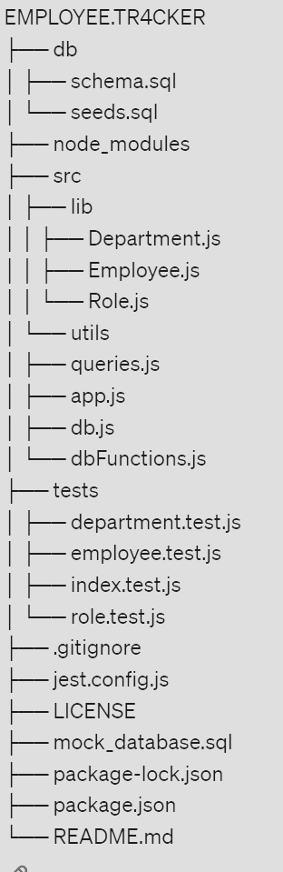

# Employee Tracker App

## Description
The Employee Tracker is a command-line application built with Node.js, leveraging Inquirer for interactive prompts and MySQL2 for database management. It allows business owners to effectively oversee and manage their company's organizational structure, including departments, roles, and employee data.

## Table of Contents
 [Description](#i-description)  
 [Getting Started](#ii-getting-started)  
 [Prerequisites](#a-prerequisites)  
 [Installation](#b-installation)  
 [Usage](#iii-usage)  
 [Running the Application](#a-running-the-application)  
 [Functionality](#b-functionality)  
 [Features](#iv-features)  
 [File Directory Structure](#v-file-directory-structure)  
 [Database Schema](#vi-database-schema)  
 [Database Configuration](#vii-database-configuration)  
 [Tests](#viii-tests)  
 [Contributing](#ix-contributing)  
 [License](#x-license)  
 [User Story](#xi-user-story)  
 [Acceptance Criteria](#xii-acceptance-criteria)

## I. Description
The Employee Tracker is a command-line application built with Node.js, leveraging Inquirer for interactive prompts and MySQL2 for database management. It allows business owners to effectively oversee and manage their company's organizational structure, including departments, roles, and employee data.

## II. Getting Started

### A. Prerequisites
Before using the Employee Tracker, ensure the following are installed:
- Node.js
- MySQL
- Inquirer (for collecting input from the command line)
- MySQL2 (to connect to your MySQL database)

### B. Installation
1. Clone the repository to your local machine:
   ```bash
   git clone <repository-url>
2. Navigate to the project directory in the terminal:
   ```bash
   cd employee-tracker
3. Install the required dependencies (including Inquirer and MySQL2):
   ```bash
   npm install
4. Create a MySQL database using the schema provided in `db/schema.sql`.
5. Configure your database connection details in `config/dbConfig.js` with your personal credentials.

## III. Usage

### A. Running the Application
1. Make sure your MySQL server is running.
2. Update `config/dbConfig.js` with your MySQL credentials.
3. Save your changes and start the application:
   ```bash
   npm start

### B. Functionality
- **View all departments, roles, and employees**
- **Add new departments, roles, and employees**
- **Update existing employee roles**
- **View employees by department and manager**

## IV. Features
- Interactive command-line interface using Inquirer
- Robust database management with MySQL2
- Class-based structure for managing database operations
- Graceful handling of database connections and shutdown

## V. File Directory Structure
Below is the file directory structure of the Employee Tracker App:



## VI. Database Schema
The MySQL database schema consists of the following tables:

- `department`: with fields for id, name, and description
- `role`: with fields for id, title, salary, department_id, and required_skills
- `employee`: with fields for id, first_name, last_name, role_id, manager_id, and hire_date

Detailed field definitions are included in `db/schema.sql`.

## VII. Database Configuration
Configure the database connection in `config/dbConfig.js`. Follow the installation guide to set up your environment.

## VIII. Tests
Run tests to validate the functionalities of the Employee Tracker:

```bash
npm test
## IX. Contributing
Community contributions are welcome. For any suggestions or issues, please follow the contribution guidelines provided in [CONTRIBUTING.md](CONTRIBUTING.md).

## X. License
This project is licensed under the MIT License.

## XI. User Story
As a business owner,  
I want to manage the departments, roles, and employees in my company effectively  
so that I can organize and plan my business efficiently.

## XII. Acceptance Criteria
Given a command-line application that accepts user input,

When I start the application,  
then I am presented with options to view all departments, roles, and employees, add a department, add a role, add an employee, and update an employee role.

When I choose to view all departments,  
then I am presented with a formatted table showing department names and department IDs.

When I choose to view all roles,  
then I am presented with a formatted table showing the job title, role ID, the department that role belongs to, and the salary for that role.

When I choose to view all employees,  
then I am presented with a formatted table showing employee data, including employee IDs, first names, last names, job titles, departments, salaries, and managers that the employees report to.

When I choose to add a department,  
then I am prompted to enter the name of the department, and that department is added to the database.

When I choose to add a role,  
then I am prompted to enter the name, salary, and department for the role, and that role is added to the database.

When I choose to add an employee,  
then I am prompted to enter the employee’s first name, last name, role, and manager, and that employee is added to the database.

When I choose to update an employee role,  
then I am prompted to select an employee to update and their new role, and this information is updated in the database.
